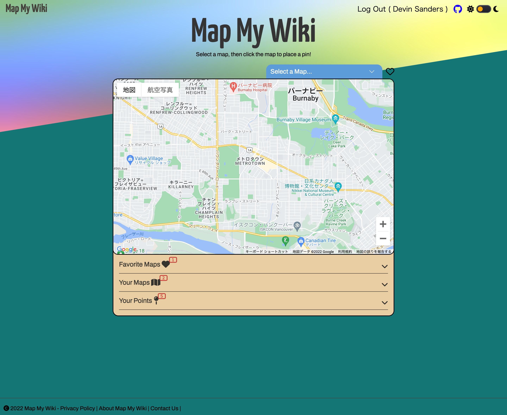
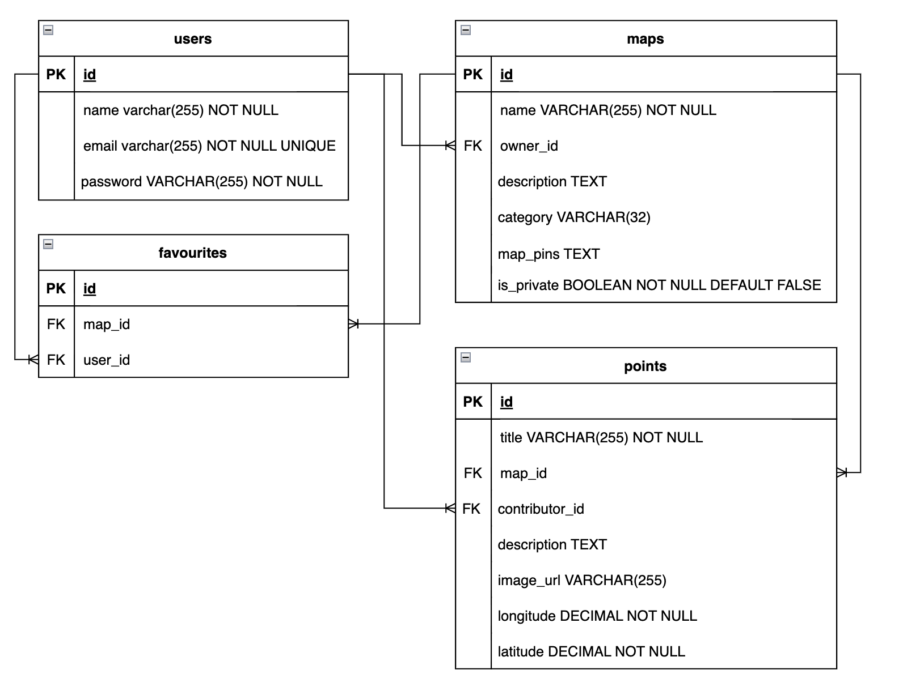

# MapMyWiki

Map My Wiki is geo-wiki type application created for <a href="www.lighthouselabs.ca">LightHouseLabs.ca</a> mid-term project to exercise our skills to date in the course including front and back end scripting in Javascript, Postgress SQL, HTML and CSS.

MapMyWiki is a joint effort between
- Ernie Johnson
- Atsuyuki
## Top Page View

---
## Contents...
1. [Getting Started](#Getting-Started)
2. [Features](#features)
3. [Future Plans](#future-plans)
4. [Detailed Operation](#detailed-operation)
5. [Known Bugs](#known-bugs)
6. [ERD](#ERD)
7. [Attributions](#attributions)
8. [Updates](#updates)
---
## Getting Started
1. Create the `.env` by using `.env.example` as a reference: `cp .env.example .env`
2. Update the .env file with your correct local information
  - username: `labber`
  - password: `labber`
  - database: `midterm`
'labber' must has all GRANT of operation on 'midterm'.
3. Install dependencies: `npm i`
4. Fix to binaries for sass: `npm rebuild node-sass`
5. Reset database: `npm run db:reset`
  - Check the db folder to see what gets created and seeded in the SDB
7. Run the server: `npm run local`
  - Note: nodemon is used, so you should not have to restart your server
8. Visit `http://localhost:8080/`
---
## Features...
- Users can create and share maps/private maps
- Users can create and share pins on maps
- Users can not edit private maps
[( back to top 🔺)](#MapMyWiki)
---
## Future Plans...
- allow additional sorting of any displayed results
- allow map owner to style their app with custom backgrounds and icons
- dark mode styling on the map
- style entire project for responsive design: mobile to desktop
[( back to top 🔺)](#MapMyWiki)
---
## Detailed Operation...
- dfdfdf

[( back to top 🔺)](#MapMyWiki)
---
## Known Bugs...
- Vertical scroll bar is forced 'always' on' to prevent page shifts when data exceeds bottom of viewable space.
- This application has been tested on Windows 11 via WSL, Ubuntu Linux 20.04, and MacOS 16 Ventura. All platforms tested with Chrome and Firefox browsers. Please report any bugs found!
[( back to top 🔺)](#MapMyWiki)
---
# ERD

---
## Attributions...
- [conColors](https://github.com/ej8899/conColors) (misc. functions)
- [conColors](https://github.com/ej8899/conColors) (misc. CSS for dark mode template)
- FontAwesome
- Google Fonts, Google Maps API
- Ajax
- Node.js
- PostgreSQL
- SCSS (CSS)
- ExpressJS
- JQuery
- bcrypt
- cookie-session
- dotenv
- morgan
- eslint
- nodemon
[( back to top 🔺)](#MapMyWiki)
---
## Updates...
- Get the latest of our version of MapMyWiki on [Github here](https://github.com/ej8899/lhl-midterm).
[( back to top 🔺)](#MapMyWiki)
---
